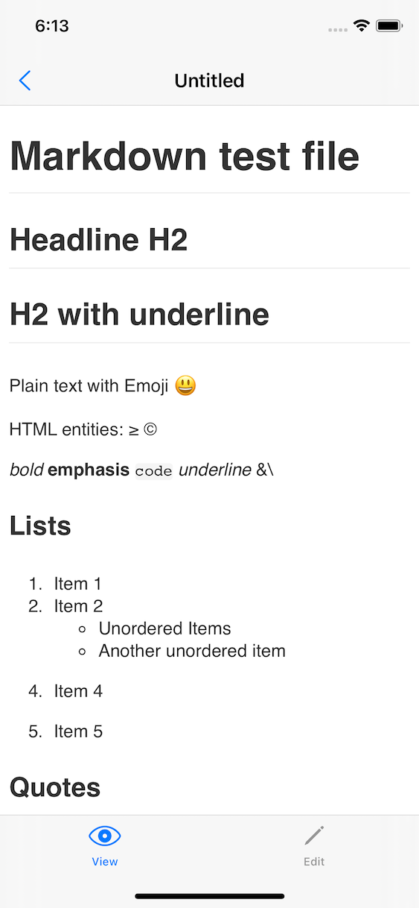
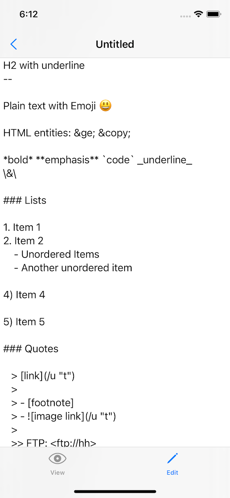
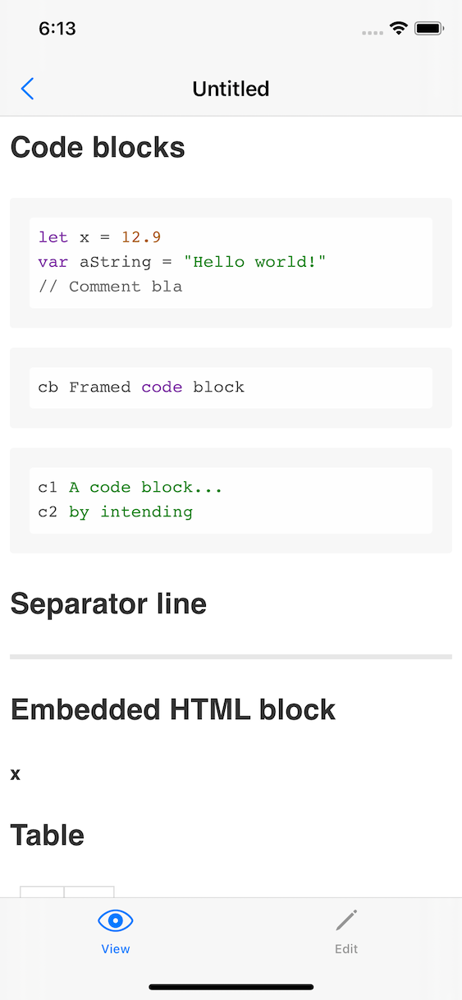
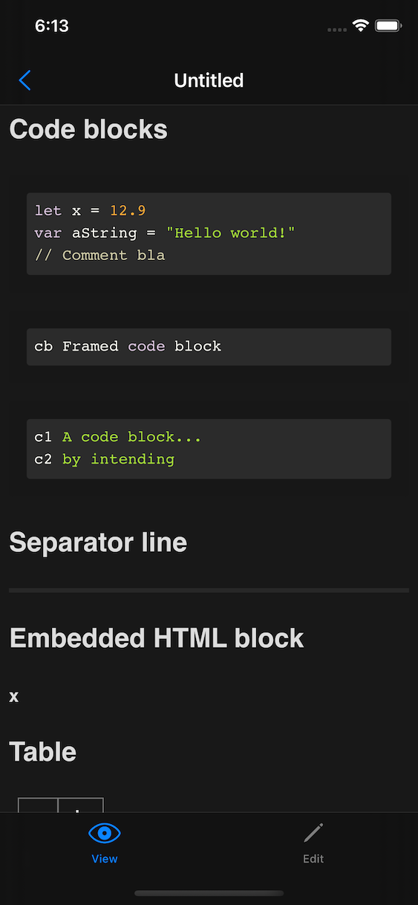

#  Markdown

A simple prototype to test my integration of the GitHub markdown implementation (based on my Swift package  [swift-cmark-gfm](https://github.com/pd95/swift-cmark-gfm)) into an iOS app. (possibly later also for macOS)

## Features

- Using SwiftUI app lifecycle `App` and document model `DocumentGroup` and `FileDocument` (=automatic support for file browser to create files locally or in iCloud)
- Use `cmark-gfm` based Swift package [swift-cmark-gfm](https://github.com/pd95/swift-cmark-gfm) to implement the GitHub flawored markdown rendering
- Use `WebView` along with custom CSS styling to render generated HTML
- Use [highlight.js](https://highlightjs.org) to dynamically apply syntax highlighting. (I would prefer something static but for the moment I'm happy with this solution)
- Supports light and dark mode in rendered HTML using `@media` queries

## Screenshots

